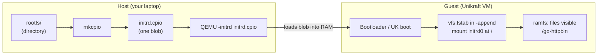
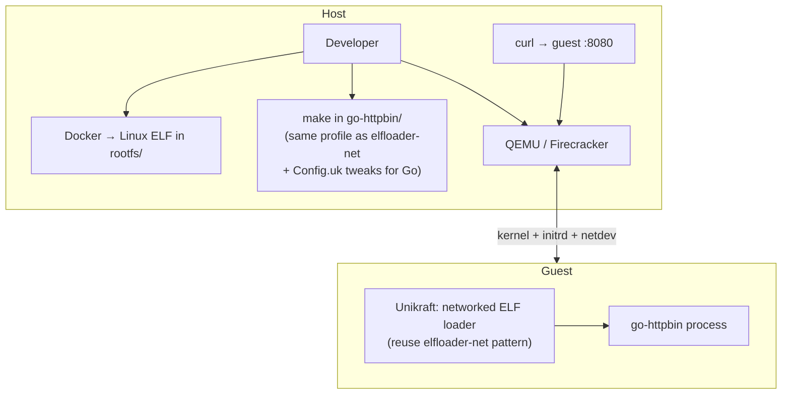
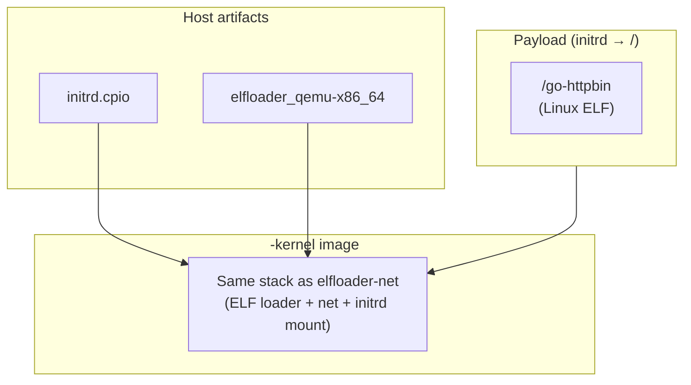
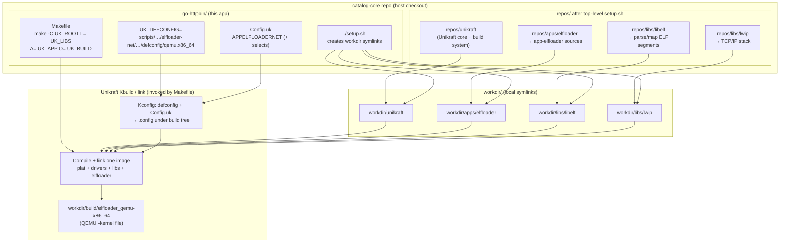
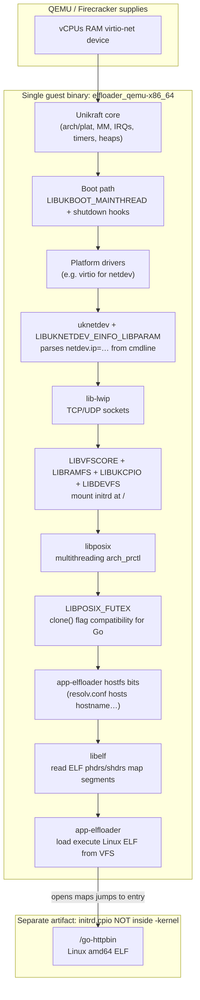
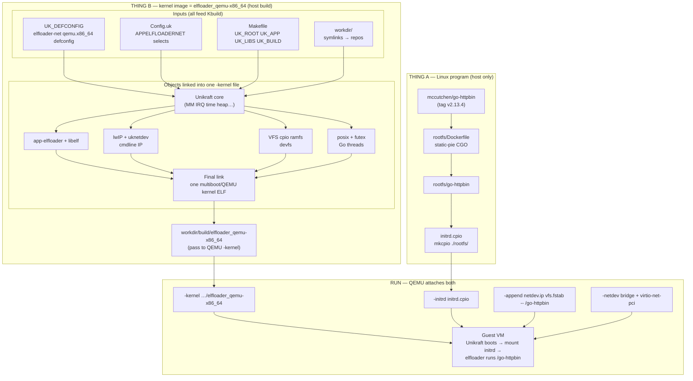
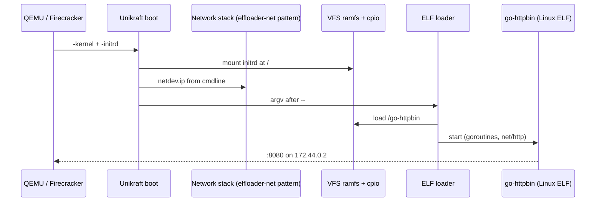

# `go-httpbin` on Unikraft (bincompat) — complete guide

**Audience:** you are working in `**catalog-core/go-httpbin`** and want one document that explains **binary compatibility (bincompat)**, the **ELF loader**, `**initrd`**, how this app relates to **[mccutchen/go-httpbin](https://github.com/mccutchen/go-httpbin)** and catalog **[httpbingo](https://github.com/unikraft/catalog/tree/staging/library/httpbingo)** — with **links** end-to-end.

This file lives **next to** the app: treat paths as relative to `**go-httpbin/`** unless stated otherwise.

---

## Table of contents

1. [Glossary](#1-glossary)
2. [What is `initrd.cpio`, exactly?](#2-what-is-initrdcpio-exactly)
3. [Elfloader kernel (Thing B): reuse the `elfloader-net` pattern](#3-elfloader-kernel-thing-b-reuse-the-elfloader-net-pattern)
4. [System design — implementing this app (for presentation)](#4-system-design--implementing-this-app-for-presentation)
   - [4.3.1 Kernel image: full build pipeline (host)](#431-kernel-image-full-build-pipeline-host)
   - [4.3.2 What lives inside `elfloader_qemu-x86_64`?](#432-what-lives-inside-elfloader_qemu-x86_64)
   - [4.7 How to document the kernel image (system design / slides)](#47-how-to-document-the-kernel-image-system-design--slides)
5. [Big picture: two builds, one QEMU](#5-big-picture-two-builds-one-qemu)
6. [Bincompat vs native Unikraft](#6-bincompat-vs-native-unikraft)
7. [Related `catalog-core` examples (links)](#7-related-catalog-core-examples-links)
8. [Walkthrough: `go-httpbin` (this directory)](#8-walkthrough-go-httpbin-this-directory)
9. [Why the Linux `go-httpbin` is built that way (`Dockerfile`)](#9-why-the-linux-go-httpbin-is-built-that-way-dockerfile)
10. [Troubleshooting](#10-troubleshooting)
11. [Customize or extend](#11-customize-or-extend)
12. [Official docs & upstream repos](#12-official-docs--upstream-repos)
13. [One-line summary](#one-line-summary)

---

## 1. Glossary


| Term                                 | Meaning                                                                                                                                                                                                                                                                                                                                                                            |
| ------------------------------------ | ---------------------------------------------------------------------------------------------------------------------------------------------------------------------------------------------------------------------------------------------------------------------------------------------------------------------------------------------------------------------------------- |
| **Binary compatibility (bincompat)** | You do **not** compile **[mccutchen/go-httpbin](https://github.com/mccutchen/go-httpbin)** as a Unikraft library. You build a **normal Linux amd64 ELF**, put it in `**rootfs/`**, pack `**initrd.cpio**`, and boot Unikraft with `**[app-elfloader](https://github.com/unikraft/app-elfloader)**` — the kernel-side component that **runs Linux ELFs** via syscall compatibility. |
| **ELF loader**                       | Unikraft app `[app-elfloader](https://github.com/unikraft/app-elfloader)`: loads your `**/go-httpbin`** from VFS, maps ELF segments, runs the program.                                                                                                                                                                                                                             |
| **Payload / Thing A**                | Almost always **one file**: `**rootfs/go-httpbin`** → appears as `**/go-httpbin**` in the guest after CPIO extract. Built with **Docker** (or host Go) on the **host**, not by Unikraft `make`.                                                                                                                                                                                    |
| **Kernel / Thing B**                 | The **same kind of Unikraft image** as [`elfloader-net`](https://github.com/unikraft/catalog-core/tree/main/elfloader-net): **networked ELF loader** (lwIP + `APPELFLOADERNET`-style `Config.uk`), built with `make` → e.g. `workdir/build/elfloader_qemu-x86_64`. Passed to QEMU as `-kernel`.                                                                                        |
| `**initrd.cpio**`                    | CPIO archive of `./rootfs/`; `**-initrd**` in QEMU / Firecracker.                                                                                                                                                                                                                                                                                                                  |
| `**vfs.fstab=…**`                    | Cmdline: mount initrd at `**/**` as **ramfs** so `**/go-httpbin`** exists.                                                                                                                                                                                                                                                                                                         |
| `**--` in cmdline**                  | After `**--`**, the ELF loader runs `**/go-httpbin**` (same pattern as `[elfloader-net](https://github.com/unikraft/catalog-core/tree/main/elfloader-net)`’s `/c-server`).                                                                                                                                                                                                         |


---

## 2. What is `initrd.cpio`, exactly?

**Short answer:** `initrd.cpio` is a **single file** on your **host** that **archives the entire `rootfs/` directory tree** in **cpio** format (the same family of format Linux uses for **initramfs**). QEMU / Firecracker passes it to the guest as the **initial RAM disk**. Unikraft does **not** “run” the cpio file — it **unpacks / mounts** it through **VFS** so paths like `**/go-httpbin`** exist **inside the VM** like a normal read-only tree in RAM.

### How it ties into the workflow




| Step | What happens                                                                                                                                                                         |
| ---- | ------------------------------------------------------------------------------------------------------------------------------------------------------------------------------------ |
| 1    | You build `**rootfs/go-httpbin**` (and any other files you add under `rootfs/`).                                                                                                     |
| 2    | `**mkcpio initrd.cpio ./rootfs/**` walks `rootfs/` and writes a **cpio** stream into `**initrd.cpio`**.                                                                              |
| 3    | QEMU `**-initrd ./initrd.cpio**` attaches that blob to the VM firmware/boot path.                                                                                                    |
| 4    | On boot, the cmdline `**vfs.fstab=[ "initrd0:/:extract::ramfs=1:" ]**` tells Unikraft: treat `**initrd0**` as the initrd source, **extract** entries, mount at `**/`** as **ramfs**. |
| 5    | The **ELF loader** then opens `**/go-httpbin`** via the same VFS — it is just a path on that ramfs.                                                                                  |


**Why cpio (not ext4 img)?** Catalog-core first-principles flows standardize on **cpio + ramfs** + Unikraft’s `**mkcpio`** helper: no loop device on the host, one command, same pattern as `[elfloader-net](https://github.com/unikraft/catalog-core/tree/main/elfloader-net)`.

**Invariant:** whatever path you put after `**--`** in `-append` must exist **inside** the mounted tree — for this app that is `**/go-httpbin`** because the file in the archive is `**rootfs/go-httpbin**` (cpio paths are usually relative to `/`).

---

## 3. Elfloader kernel (Thing B): reuse the `elfloader-net` pattern

You do **not** need to invent a new “kernel layout” for every bincompat app that speaks TCP. **`go-httpbin` is not built inside the `elfloader-net/` directory** — it is a **separate app folder** that **reuses the same recipe** catalog-core already uses for **[`elfloader-net`](https://github.com/unikraft/catalog-core/tree/main/elfloader-net)**.

### What “reuse `elfloader-net`” means

1. **Same class of Unikraft build** — still **`app-elfloader`** as `UK_APP` (the ELF loader lives under `workdir/apps/elfloader`, same as other bincompat examples). The guest is still “Unikraft + loader + syscall compatibility,” not a native port of your Go program.
2. **Same networking profile** — include **lwIP** in the tree (`setup.sh` symlink to `repos/libs/lwip`, `UK_LIBS` … `lwip` …) and enable the **networking ELF loader** Kconfig bundle (**`APPELFLOADERNET`**-style options in `Config.uk`), so virtio + bridge + **`netdev.ip=…`** behave like `elfloader-net`.
3. **Same operational shape** — **`initrd.cpio`** + **`vfs.fstab=…`** + **`-append '… -- /your-binary'`** matches the `elfloader-net` flow; only the path after `--` and the contents of `rootfs/` change for `go-httpbin`.
4. **Only what Go needs on top** — e.g. **`LIBPOSIX_FUTEX`** in this repo’s `Config.uk` so `clone` does not fail with unsupported flags. That is a **small delta** on top of the `elfloader-net` baseline, not a different stack you have to name library-by-library in a deck.

**Defconfig:** this app’s README uses the **pre-made defconfig URL from the `scripts/elfloader-net` path** on the `scripts` branch so the heavy Kconfig choices align with `elfloader-net`; then **`Config.uk` in this directory** layers the Go-specific bits.

### Quick reference (if you compare dirs)

| Piece | Same idea as `elfloader-net` | `go-httpbin`-specific |
| ----- | ---------------------------- | ---------------------- |
| `UK_APP` | `workdir/apps/elfloader` | Same |
| lwIP in build | Symlink + `UK_LIBS` includes `lwip` | Same pattern as [`elfloader-net/Makefile`](https://github.com/unikraft/catalog-core/blob/main/elfloader-net/Makefile) |
| `Config.uk` | `APPELFLOADERNET` + VFS/cpio/ramfs | Add **`LIBPOSIX_FUTEX`** (and any other payload quirks) |
| Run | `netdev.ip`, `vfs.fstab`, `-- /…` | `-- /go-httpbin` |

**Bottom line:** treat **Thing B** as “**take the networked ELF-loader build from `elfloader-net`**, copy the wiring into your app tree, adjust `Config.uk` / payload / cmdline.” You rarely fork `app-elfloader` itself.

---

## 4. System design — implementing this app (for presentation)

Use this section as **slide fodder**: problem → architecture → phases → verification.

### 4.1 Problem statement (1 slide)

- **Goal:** run **[mccutchen/go-httpbin](https://github.com/mccutchen/go-httpbin)** (HTTP test service, **:8080**) on **Unikraft** using **first-principles** tooling (**Make**, **QEMU/Firecracker**), aligned with catalog **[httpbingo](https://github.com/unikraft/catalog/tree/staging/library/httpbingo)**.
- **Constraint:** do **not** port the Go app to native Unikraft APIs; use **binary compatibility** — a **Linux ELF** inside an **initrd**, executed by `**app-elfloader`**.

### 4.2 High-level system context (C4 “system context”)




### 4.3 Container view (what runs where)



### 4.3.1 Kernel image: full build pipeline (host)

**What you are building:** one **x86_64 Unikraft/QEMU kernel file** (`workdir/build/elfloader_qemu-x86_64`) that **embeds** Unikraft core, **`app-elfloader`**, **`lib-elf`**, **`lib-lwip`**, and everything **`APPELFLOADERNET`** pulls in via Kconfig. It is produced entirely by **`make`** in `go-httpbin/` (not by Go).



**Reading the Makefile:** `UK_APP` is always **`workdir/apps/elfloader`** — the “application” being built is the **ELF loader**, not `go-httpbin`. `UK_LIBS` puts **`$(PWD)` first** so this directory’s **`Config.uk`** is visible to Kconfig, then **`libelf`** and **`lwip`**.

### 4.3.2 What lives inside `elfloader_qemu-x86_64`?

At **link time**, everything below ends up in **one** linked binary (plus debug symbols if enabled). **`go-httpbin` is not linked in** — it is supplied later via **`-initrd`**.



**Kconfig source of truth:** the `select` lines under **`APPELFLOADERNET`** in [`Config.uk`](./Config.uk) are the authoritative list of what this profile enables (elfloader options, VFS/cpio/ramfs/devfs, threading, **futex**, **lwIP**, **netdev cmdline parsing**, larger loader stack).

### 4.4 Implementation phases (for a project plan / Gantt-style slide)


| Phase                    | Deliverable                                                          | Key commands / files                                                                                                                                                  |
| ------------------------ | -------------------------------------------------------------------- | --------------------------------------------------------------------------------------------------------------------------------------------------------------------- |
| **P0 — Repos**           | Same `repos/` layout as other catalog-core apps (see `elfloader-net`); `go-httpbin/setup.sh` adds **lwIP** like `elfloader-net` | Top-level `[catalog-core/setup.sh](https://github.com/unikraft/catalog-core/blob/main/setup.sh)`                                                                      |
| **P1 — App wiring**      | `workdir/` symlinks                                                  | `[./setup.sh](./setup.sh)`                                                                                                                                            |
| **P2 — Linux payload**   | `rootfs/go-httpbin`                                                  | `[make -C rootfs/](./rootfs/Makefile)`, `[rootfs/Dockerfile](./rootfs/Dockerfile)`                                                                                    |
| **P3 — Initrd**          | `initrd.cpio`                                                        | `./workdir/unikraft/support/scripts/mkcpio initrd.cpio ./rootfs/`                                                                                                     |
| **P4 — Unikraft kernel** | `workdir/build/elfloader_*`                                          | `[UK_DEFCONFIG=… make defconfig](./README.md)`, `**make -j$(nproc)`**                                                                                                 |
| **P5 — Network on host** | `virbr0` + `172.44.0.1/24`, `bridge.conf`                            | [catalog-core README — QEMU](https://github.com/unikraft/catalog-core/blob/main/README.md#qemu) |
| **P6 — Run**             | VM up, `curl` works                                                  | QEMU line in `[README.md](./README.md)`, or `[fc.x86_64.json](./fc.x86_64.json)`                                                                                      |
| **P7 — Verify**          | HTTP 200 + 418                                                       | `curl http://172.44.0.2:8080/`, `curl -I …/status/418`                                                                                                                |


### 4.5 Responsibility split (who owns what)


| Concern                                   | **Who implements it**                                                                                                            |
| ----------------------------------------- | -------------------------------------------------------------------------------------------------------------------------------- |
| HTTP routes, Go version                   | **Upstream** [mccutchen/go-httpbin](https://github.com/mccutchen/go-httpbin) — you pin a **tag** in Docker                       |
| Producing a Linux ELF suitable for loader | **You** — `[rootfs/Dockerfile](./rootfs/Dockerfile)` (**static-pie** choice)                                                     |
| Packing files for the guest               | **You** — `**mkcpio`**                                                                                                           |
| ELF decode, process start, many syscalls  | **Unikraft** — `[app-elfloader](https://github.com/unikraft/app-elfloader)` + `[unikraft](https://github.com/unikraft/unikraft)` |
| TCP/IP to host bridge                     | **Unikraft lwIP** + **QEMU netdev** — configured via `[Config.uk](./Config.uk)` + `**-netdev`** + `**netdev.ip=**`               |


### 4.6 Risk / decision log (optional slide)


| Topic                        | Decision                                                                                                                                     |
| ---------------------------- | -------------------------------------------------------------------------------------------------------------------------------------------- |
| Dynamic Go PIE vs static-pie | **Static-pie** (catalog-style) avoids missing `**ld-linux`** in initrd — see [§9](#9-why-the-linux-go-httpbin-is-built-that-way-dockerfile). |
| Go threads                   | Enable `**LIBPOSIX_FUTEX**` in `[Config.uk](./Config.uk)` — see [§10](#10-troubleshooting).                                                  |
| RAM                          | **256 MiB** in Firecracker JSON; match QEMU `**-m`** — raise if Go OOMs.                                                                     |


### 4.7 How to document the kernel image (system design / slides)

Use this as a **checklist** when you write design docs or deck slides **only about Thing B** (the `-kernel` file).

1. **One-sentence definition** — “The kernel image is a **single statically linked Unikraft binary** that boots the VM, provides **Linux syscall compatibility**, **lwIP**, **VFS + initrd mount**, and **`app-elfloader`**, which **loads** the Linux ELF from the initrd; **`go-httpbin` is not compiled into this file.**”
2. **Build pipeline slide** — Reuse [§4.3.1](#431-kernel-image-full-build-pipeline-host): `repos/` → `workdir/` → `Makefile` / `Config.uk` / `defconfig` → Kbuild → **`elfloader_qemu-x86_64`**.
3. **Logical architecture slide** — Reuse [§4.3.2](#432-what-lives-inside-elfloader_qemu-x86_64): vertical stack from **hardware** → **Unikraft core** → **virtio + netdev** → **lwIP** → **VFS/cpio** → **POSIX + futex** → **libelf + elfloader**; **dashed boundary** to **initrd** (not in the binary).
4. **Configuration responsibility** — Table: **`defconfig`** (baseline QEMU x86_64 from `elfloader-net` scripts branch), **`Config.uk`** (`APPELFLOADERNET` + Go **`LIBPOSIX_FUTEX`**), **`UK_APP` / `UK_LIBS`** in [`Makefile`](./Makefile), **`setup.sh`** symlinks.
5. **Runtime / boot slide** — Short sequence: firmware/QEMU loads **`-kernel`** → Unikraft init → parse **`netdev.ip`** / **`vfs.fstab`** → mount initrd → **elfloader** reads argv after **`--`** → **`exec`-class load of `/go-httpbin`**. (See also the sequence diagram in [§8.9](#89-runtime-sequence).)
6. **Interfaces** — **Inputs to the image at run time:** QEMU **cmdline** (`-append`), **initrd blob**, virtio-net to **host bridge**. **Outputs:** guest listens on **:8080**; host **`curl`** to guest IP.
7. **Traceability** — Link **`APPELFLOADERNET`** lines in `Config.uk` to the **layers** in §4.3.2 so reviewers see *why* each block exists.

---

## 5. Big picture: two builds, one QEMU

End-to-end view: **payload** (Thing A) vs **kernel image** (Thing B) vs **runtime**. For **Thing B** internals, see [§4.3.1](#431-kernel-image-full-build-pipeline-host) and [§4.3.2](#432-what-lives-inside-elfloader_qemu-x86_64).




**Rule of thumb:** `make -C rootfs/` builds the **Go Linux binary** (Thing A). `make` in `go-httpbin/` builds the **kernel image** using the **same pattern as `elfloader-net`** (Thing B), plus this directory’s `Config.uk`. QEMU joins **`-kernel`** and **`-initrd`** the same way as in `elfloader-net`.

---

## 6. Bincompat vs native Unikraft


|                     | **Native** (e.g. `[c-hello](https://github.com/unikraft/catalog-core/tree/main/c-hello)`) | `**go-httpbin` (this app)**                                                                                                             |
| ------------------- | ----------------------------------------------------------------------------------------- | --------------------------------------------------------------------------------------------------------------------------------------- |
| `UK_APP`            | Your app directory                                                                        | `**[workdir/apps/elfloader](https://github.com/unikraft/app-elfloader)`**                                                               |
| Your Go / HTTP code | Would be compiled via Unikraft + ports                                                    | **Not** compiled by Unikraft; **prebuilt ELF** in initrd                                                                                |
| Networking          | You’d wire Unikraft netdev APIs                                                           | **lwIP** + `**netdev.ip=…`** cmdline (same idea as `[elfloader-net](https://github.com/unikraft/catalog-core/tree/main/elfloader-net)`) |


---

## 7. Related `catalog-core` examples (links)


| Directory                                                                                                                                                                                               | How it relates to `**go-httpbin**`                                                                                                 |
| ------------------------------------------------------------------------------------------------------------------------------------------------------------------------------------------------------- | ---------------------------------------------------------------------------------------------------------------------------------- |
| `**[go-httpbin](https://github.com/unikraft/catalog-core/tree/main/go-httpbin)**` (here)                                                                                                                | **[httpbingo](https://github.com/unikraft/catalog/tree/staging/library/httpbingo)**-style HTTP test server via ELF loader + bridge |
| `**[elfloader-net](https://github.com/unikraft/catalog-core/tree/main/elfloader-net)`**                                                                                                                 | Same **KVM + bridge + `netdev.ip` + `vfs.fstab` + `-- /…`** pattern; C binary instead of Go                                        |
| `**[elfloader-basic](https://github.com/unikraft/catalog-core/tree/main/elfloader-basic)**`                                                                                                             | ELF loader **without** network — minimal bincompat                                                                                 |
| `**[bincompat-c-hello](https://github.com/unikraft/catalog-core/tree/main/bincompat-c-hello)`** / `**[bincompat-rust-hello](https://github.com/unikraft/catalog-core/tree/main/bincompat-rust-hello)**` | Other Linux ELFs; different payloads, same “loader + initrd” idea                                                                  |
| `**[catalog-core` README](https://github.com/unikraft/catalog-core/blob/main/README.md)**                                                                                                               | **QEMU bridge**, Docker, Firecracker, requirements                                                                                 |


---

## 8. Walkthrough: `go-httpbin` (this directory)

### 8.1 Files and roles


| File                                       | Role                                                                                                                                                                                                                                                     |
| ------------------------------------------ | -------------------------------------------------------------------------------------------------------------------------------------------------------------------------------------------------------------------------------------------------------- |
| `[README.md](./README.md)`                 | **Commands**: setup, defconfig, `make`, bridge, QEMU, **curl** tests                                                                                                                                                                                     |
| `[setup.sh](./setup.sh)`                   | Symlinks `**workdir/unikraft`**, `**workdir/libs/{libelf,lwip}**`, `**workdir/apps/elfloader**` → `../repos/…`                                                                                                                                           |
| `[Makefile](./Makefile)`                   | `**UK_APP**` → elfloader; `**UK_LIBS**` → `**$(PWD):libelf:lwip**` so Kconfig sees this dir + libs                                                                                                                                                       |
| `[Makefile.uk](./Makefile.uk)`             | Empty (no Unikraft compilation from *this* dir)                                                                                                                                                                                                          |
| `[Config.uk](./Config.uk)`                 | `**APPELFLOADERNET*`*: elfloader + VFS + **lwIP** + multithreading + `**LIBPOSIX_FUTEX`** + einfo                                                                                                                                                        |
| `[rootfs/Dockerfile](./rootfs/Dockerfile)` | Clones **[go-httpbin v2.13.4](https://github.com/mccutchen/go-httpbin/releases/tag/v2.13.4)**, **CGO static-pie** build (matches [catalog `httpbingo` Dockerfile](https://github.com/unikraft/catalog/blob/staging/library/httpbingo/2.13.4/Dockerfile)) |
| `[rootfs/Makefile](./rootfs/Makefile)`     | `**docker build`** + `**docker cp**` → `**rootfs/go-httpbin**`                                                                                                                                                                                           |
| `[fc.x86_64.json](./fc.x86_64.json)`       | Firecracker: `**-- /go-httpbin**`, **256 MiB**, tap `**tap0`**                                                                                                                                                                                           |


### 8.2 `setup.sh` and `workdir/`

From repo root once: `[catalog-core/setup.sh](https://github.com/unikraft/catalog-core/blob/main/setup.sh)`. From `**go-httpbin/**`: `[./setup.sh](./setup.sh)`.

Symlinks created:

```text
workdir/unikraft           → ../../repos/unikraft
workdir/libs/libelf        → ../../../repos/libs/libelf
workdir/libs/lwip          → ../../../repos/libs/lwip
workdir/apps/elfloader     → ../../../repos/apps/elfloader
```

### 8.3 Payload: `rootfs/` — build `go-httpbin` the Linux ELF

```bash
make -C rootfs/
```

Produces `**rootfs/go-httpbin**` — a **Linux amd64** binary the ELF loader will execute as `**/go-httpbin`** after CPIO mount.

Details: `[rootfs/Dockerfile](./rootfs/Dockerfile)`, `[README.md` “Build the Linux ELF”](./README.md).

### 8.4 `mkcpio` → `initrd.cpio`

```bash
rm -f initrd.cpio
./workdir/unikraft/support/scripts/mkcpio initrd.cpio ./rootfs/
```

Script in Unikraft tree: `[support/scripts/mkcpio](https://github.com/unikraft/unikraft/tree/staging/support/scripts)`.

### 8.5 `Makefile` / `Makefile.uk`

`[Makefile](./Makefile)`:

```makefile
UK_APP ?= $(PWD)/workdir/apps/elfloader
UK_LIBS ?= $(PWD):$(LIBS_BASE)/libelf:$(LIBS_BASE)/lwip
```

- `**$(PWD):**` — this directory’s `[Config.uk](./Config.uk)` is on the Kconfig path.
- `**libelf` + `lwip**` — match networking ELF loader setups (`[elfloader-net/Makefile](https://github.com/unikraft/catalog-core/blob/main/elfloader-net/Makefile)`).

`[Makefile.uk](./Makefile.uk)` stays **empty**.

### 8.6 `Config.uk` (Kconfig)

`[Config.uk](./Config.uk)` selects `**APPELFLOADERNET`** (not the base loader): **ELF loader + lwIP + vfs + multithreading**.

Critical for **Go**:

- `**select LIBPOSIX_FUTEX`** — Go’s runtime uses `**clone(2)**` with `**CLONE_CHILD_CLEARTID**`. `[libposix-futex](https://github.com/unikraft/unikraft/tree/staging/lib/posix-futex)` registers the clone bit so `[libposix-process/events.c](https://github.com/unikraft/unikraft/blob/staging/lib/posix-process/events.c)` does not reject `**0x3d0f00**`.

Without it you get: `**Unsupported clone flags requested: 0x3d0f00**`.

### 8.7 `defconfig` + `make`

`[README.md](./README.md)` uses the **same scripted defconfig family** as `**elfloader-net`** (same Kconfig symbol `**APPELFLOADERNET**`):

```bash
wget -O /tmp/defconfig https://raw.githubusercontent.com/unikraft/catalog-core/refs/heads/scripts/elfloader-net/scripts/defconfig/qemu.x86_64
UK_DEFCONFIG=/tmp/defconfig make defconfig

grep CONFIG_LIBPOSIX_FUTEX workdir/apps/elfloader/.config
grep CONFIG_ARCH_X86_64 workdir/apps/elfloader/.config

make properclean
make -j"$(nproc)"
```

**Note:** `**.config`** is written under `**workdir/apps/elfloader/.config**` (symlink to `**repos/apps/elfloader**`), not in `go-httpbin/` itself.

Kernel artifact: `**workdir/build/elfloader_qemu-x86_64**` (QEMU) / `**elfloader_fc-x86_64**` (Firecracker — see `[fc.x86_64.json](./fc.x86_64.json)`).

### 8.8 QEMU & Firecracker cmdlines

**QEMU (KVM)** — full example in `[README.md](./README.md)`. Shape:

```bash
sudo qemu-system-x86_64 -nographic -m 256 -enable-kvm -cpu host \
  -netdev bridge,id=en0,br=virbr0 -device virtio-net-pci,netdev=en0 \
  -append 'elfloader_qemu-x86_64 netdev.ip=172.44.0.2/24:172.44.0.1::: vfs.fstab=[ "initrd0:/:extract::ramfs=1:" ] -- /go-httpbin' \
  -kernel workdir/build/elfloader_qemu-x86_64 \
  -initrd ./initrd.cpio
```


| Segment                                       | Role                                                                                                                |
| --------------------------------------------- | ------------------------------------------------------------------------------------------------------------------- |
| `elfloader_qemu-x86_64`                       | Unikraft image name / boot label.                                                                                   |
| `netdev.ip=172.44.0.2/24:172.44.0.1:::`       | Guest **172.44.0.2**, gateway **172.44.0.1** (host bridge side).                                                    |
| `vfs.fstab=[ "initrd0:/:extract::ramfs=1:" ]` | Mount initrd at `**/`**.                                                                                            |
| `-- /go-httpbin`                              | ELF loader runs `**go-httpbin**`; default HTTP port **8080** ([upstream](https://github.com/mccutchen/go-httpbin)). |


**Firecracker:** `[fc.x86_64.json](./fc.x86_64.json)` — same `**boot_args`** pattern; `**mem_size_mib`: 256**; see `[README.md` Firecracker section](./README.md).

### 8.9 Runtime sequence




**Host tests** (from `[README.md](./README.md)`):

```bash
curl -sS http://172.44.0.2:8080/ | head
curl -I http://172.44.0.2:8080/status/418
```

---

## 9. Why the Linux `go-httpbin` is built that way (`Dockerfile`)


| Topic                              | Why                                                                                                                                                                                                                                                                                                         |
| ---------------------------------- | ----------------------------------------------------------------------------------------------------------------------------------------------------------------------------------------------------------------------------------------------------------------------------------------------------------- |
| **Catalog-style CGO + static-pie** | Produces a **PIE** ELF **without** relying on a separate `**PT_INTERP`** layout that expects `**/lib64/ld-linux-x86-64.so.2**` + full glibc tree in initrd (plain `**CGO_ENABLED=0` + `-buildmode=pie**` often still records that interpreter). See comments in `[rootfs/Dockerfile](./rootfs/Dockerfile)`. |
| **Tag v2.13.4**                    | Same upstream version as catalog `**[library/httpbingo/2.13.4](https://github.com/unikraft/catalog/tree/staging/library/httpbingo/2.13.4)`**.                                                                                                                                                               |
| **Single ELF in `rootfs/`**        | Small initrd; no JVM / `.so` forest — simpler than dynamic-language bincompat demos.                                                                                                                                                                                                                        |


---

## 10. Troubleshooting


| Symptom                                           | Likely cause                                            | What to do                                                                                                                                         |
| ------------------------------------------------- | ------------------------------------------------------- | -------------------------------------------------------------------------------------------------------------------------------------------------- |
| `**Unsupported clone flags … 0x3d0f00**`          | `**LIBPOSIX_FUTEX**` not in kernel config               | Ensure `[Config.uk](./Config.uk)` has `**select LIBPOSIX_FUTEX**`, then `**make defconfig**` + rebuild                                             |
| `**1GiB pages not supported**` / paging `**-95**` | **TCG** / `**qemu64`** vs Unikraft x86_64 paging checks | Use `**-enable-kvm**` and `**-cpu host**` or `**-cpu max**` (`[README.md](./README.md)` uses **256M** + KVM)                                       |
| `**bridge helper failed`** / `**bridge.conf**`    | QEMU bridge ACL                                         | `[catalog-core/README.md#qemu](https://github.com/unikraft/catalog-core/blob/main/README.md#qemu)`: `**allow all**` in `**/etc/qemu/bridge.conf**` |
| `**grep: .config: No such file**`                 | Wrong directory / wrong path                            | `**grep … workdir/apps/elfloader/.config**` from `**go-httpbin/**`                                                                                 |
| `**curl` hangs / connection refused**             | Guest not up, wrong IP, or out of memory                | Wait after boot lines; match `**-m`** to Firecracker RAM (**256** in `[fc.x86_64.json](./fc.x86_64.json)`); raise if OOM                           |
| **VM does not exit after `curl`**                 | Expected                                                | ELF loader does not auto-shutdown; **Ctrl+a** **x** (QEMU) or `**pkill`** Firecracker — `[README.md` “Close”](./README.md)                         |


---

## 11. Customize or extend


| Goal                             | Change                                                                                                                       |
| -------------------------------- | ---------------------------------------------------------------------------------------------------------------------------- |
| **Different binary path**        | Put ELF under `rootfs/<path>`; change `**-- /…`** in QEMU `**-append**` and `[fc.x86_64.json](./fc.x86_64.json)` `boot_args` |
| **Different Go version**         | Edit `**ARG VERSION`** in `[rootfs/Dockerfile](./rootfs/Dockerfile)`; rebuild `**make -C rootfs/**` + `**mkcpio**`           |
| **Host build instead of Docker** | `[README.md` host `go build](./README.md)` (same **static-pie** flags as Docker)                                             |
| **Arm / other plat**             | Needs different defconfig / images — out of scope for this x86_64 README                                                     |


---

## 12. Official docs & upstream repos

### This app & catalog


| Resource                     | URL                                                                                                                                      |
| ---------------------------- | ---------------------------------------------------------------------------------------------------------------------------------------- |
| **This directory on GitHub** | [https://github.com/unikraft/catalog-core/tree/main/go-httpbin](https://github.com/unikraft/catalog-core/tree/main/go-httpbin)           |
| `**go-httpbin` upstream**    | [https://github.com/mccutchen/go-httpbin](https://github.com/mccutchen/go-httpbin)                                                       |
| **Catalog Kraft httpbingo**  | [https://github.com/unikraft/catalog/tree/staging/library/httpbingo](https://github.com/unikraft/catalog/tree/staging/library/httpbingo) |
| **catalog-core**             | [https://github.com/unikraft/catalog-core](https://github.com/unikraft/catalog-core)                                                     |


### Unikraft & loader


| Resource                           | URL                                                                                                    |
| ---------------------------------- | ------------------------------------------------------------------------------------------------------ |
| **Unikraft core**                  | [https://github.com/unikraft/unikraft](https://github.com/unikraft/unikraft)                           |
| **Binary compatibility (concept)** | [https://unikraft.org/docs/concepts/compatibility](https://unikraft.org/docs/concepts/compatibility)   |
| **Internals docs**                 | [https://unikraft.org/docs/internals](https://unikraft.org/docs/internals)                             |
| **VFS**                            | [https://unikraft.org/docs/internals/libs/vfscore/](https://unikraft.org/docs/internals/libs/vfscore/) |
| `**app-elfloader`**                | [https://github.com/unikraft/app-elfloader](https://github.com/unikraft/app-elfloader)                 |
| `**lib-elf**`                      | [https://github.com/unikraft/lib-elf](https://github.com/unikraft/lib-elf)                             |
| `**lib-lwip**`                     | [https://github.com/unikraft/lib-lwip](https://github.com/unikraft/lib-lwip)                           |


### External


| Topic              | URL                                                                                                      |
| ------------------ | -------------------------------------------------------------------------------------------------------- |
| **QEMU**           | [https://www.qemu.org/docs/master/](https://www.qemu.org/docs/master/)                                   |
| **Firecracker**    | [https://firecracker-microvm.github.io/](https://firecracker-microvm.github.io/)                         |
| `**clone(2)`**     | [https://man7.org/linux/man-pages/man2/clone.2.html](https://man7.org/linux/man-pages/man2/clone.2.html) |
| **CPIO**           | [https://en.wikipedia.org/wiki/Cpio](https://en.wikipedia.org/wiki/Cpio)                                 |
| **Go build modes** | [https://go.dev/wiki/GoArm](https://go.dev/wiki/GoArm)                                                   |


---

## One-line summary

**`go-httpbin` here = bincompat:** build a Linux `go-httpbin` ELF into `rootfs/`, pack `initrd.cpio`, build the Unikraft image **like `elfloader-net`** (networked ELF loader + lwIP) with **`LIBPOSIX_FUTEX`** for Go, then run QEMU/Firecracker with `netdev.ip=…`, `vfs.fstab=…`, and `-- /go-httpbin`.